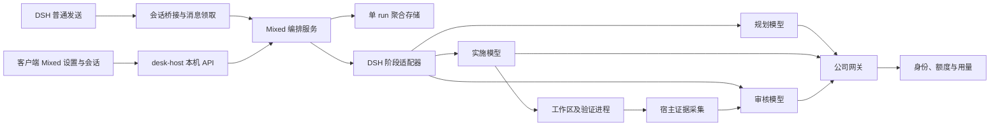
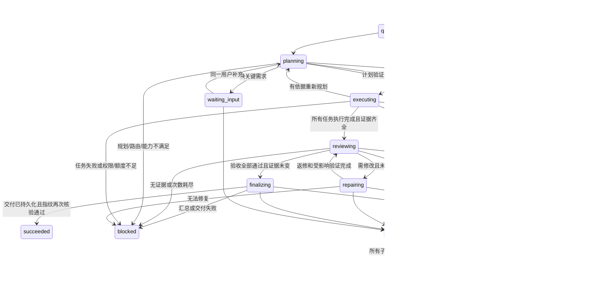

# Mixed 混合模式详细实施计划

日期：2026-09-09。状态：计划已编写，尚未实施或验证候选插件运行兼容性。

本计划承接 [插件调研](../../sessions/2026-09-09-mixed-mode-research.md)。本次交付是可执行的工程计划；下文的新模块、接口、状态和测试均为拟实现内容，不能据此认为产品已经具备这些能力。

## 1. 目标与交付边界

用户在客户端选择 **Mixed · 混合**，配置三条独立模型路由：

1. 规划模型（大模型）：理解需求、读取必要上下文、拆分子任务、建立依赖和验收标准。
2. 实施模型（小模型）：逐项实施、修改产物、运行验证、给出交接材料。
3. 审核模型：根据实际产物和验证证据独立复查；通过才交付，否则返回明确问题给实施模型返修。

首个可交付版本必须包含完整的“规划 → 多个实施任务 → 审核 → 返修 → 再审”闭环。实施任务数量与模型数量解耦，同一小模型可以连续执行多个独立 taskId。规划与审核可以选择同一个模型，但配置、调用和上下文均按两个角色独立处理。

同时交付：客户端设置、会话模式、任务进度与证据详情、取消与中断恢复、持久化、公司网关身份与用量归属、开发及离线安装验证。保持原有普通会话、公司任务卡人工验收流和权限控制的语义。

本轮计划不要求首版实现：并发写同一工作区、跨机器调度、根据成本自动换模型、无限递归、自动提交/合并/发布、公司级模型偏好同步。预留扩展接口，但不以这些扩展代替首版完整闭环。

## 2. 已核实事实与架构决定

### 2.1 当前事实

- 项目 pin 和本机内核均为 DSH **0.1.3-alpha.2**，以 `scripts/kernel/pin.json` 及运行包为准。
- `dsh-agent-team-gui` 调研源码为 1.0.1 / `561ddf5b55c433a594310f0ae6a5e21036fbcbcd`；其发布文档记载验证内核为 0.1.1-rc.2。
- 上游 DAG 以成员 agentId 为唯一键，同一成员不能在图中出现多次；不是任意任务节点 DAG。
- 普通发送时上游规划沿用 parent.options；规划异常会回退确定性分工，派发异常会允许父模型继续。Mixed 不能继承这些兜底行为。
- 上游内置审核仅消费摘要、禁止工具；执行结果存在“stopReason=error 但有文字也算 completed”的处理，不能直接作为 Mixed 成功判据。
- 上游公开导出没有私有规划/执行/审核函数；不要依赖深层私有 import。
- 当前内核 `subagents.start('spawn', ...)` 声明支持显式模型、outputSchema、toolFilter、maxDepth；运行行为和公司模型支持度仍需契约测试。
- `agent/pre-step` 仅有 enter/reject，没有已证实的 handled；reject 会把 turn 结束为 blocked。不能伪造一个不存在的“成功消费消息”返回值。
- DSH storageDomain 单条记录 update 提供写链内原子更新；没有跨记录事务、跨进程锁，不能保证外部副作用 exactly-once。

上游证据：[执行与审核](https://github.com/toolclub/dsh-agent-team-gui/blob/561ddf5b55c433a594310f0ae6a5e21036fbcbcd/src/tools/application/execution-service.ts)、[调度](https://github.com/toolclub/dsh-agent-team-gui/blob/561ddf5b55c433a594310f0ae6a5e21036fbcbcd/src/tools/orchestration.ts)、[会话接入](https://github.com/toolclub/dsh-agent-team-gui/blob/561ddf5b55c433a594310f0ae6a5e21036fbcbcd/src/index.ts)。

### 2.2 选定主路线

**公司 Mixed 服务拥有任务模型、状态机与审核规则；优先使用官方 subagents API 运行阶段。** 复用 team-gui 经审查的拓扑验证、取消收敛、交接及用量归集思路；如移植 MIT 代码，保留来源、版权及许可证。不能把这条路线称为“装插件即可完成”。

主实现落在 `plugins/desk-host/lib/mixed/`，由现有 desk-host 挂载；UI 落在 desk-ui。先不同时启用 team-gui/Cortex 的普通发送拦截，确保一条消息只有一个编排所有者。

P0 另做受控复用评估：只有当 team-gui 公司 fork 能通过显式公共 facade 提供任务节点、指定规划路由、证据审核、失败停止及取消接口，而且不再维护第二份 run 状态时，才替换内部 driver。若需要直接访问 private 方法或两套调度器同时接管，采用上述主路线，不继续扩大 fork。Cortex 保留为后续动态路由参考，不设为上线依赖。

### 2.3 组件职责



## 3. 产品行为与配置规则

### 3.1 入口

- 设置增加 `混合模式` 页，核心区域只呈现三个模型选择器、保存和连接/能力状态。
- 会话增加独立 Mixed 控件，使用现有 `conversation.input.left` 槽。当前内核没有可直接追加枚举的“普通/Plan/Mixed”总模式服务；不要把权限下拉当作模式控件。
- Mixed 与官方 Plan 互斥。空闲时开启 Mixed，需要通过官方计划模式接口退出 Plan；操作失败则不启用。运行中切模式提示先停止，不自动重发输入。
- Mixed 激活时，`conversation.input.model` 显示三模型摘要与设置入口；普通会话恢复原模型选择器及之前的选择。后端始终以 run 快照路由，不能只隐藏 UI。
- 权限菜单继续独立工作；Mixed 不提升现有 sandbox 或 approval 权限。
- 三项配置不齐全时禁用 Mixed 发送并给出配置入口。首次默认值只能作为待保存建议，不能凭模型名字自动认定能力或静默选付费模型。

### 3.2 配置归属和形状（拟定）

模型偏好是“本机 + profile + 登录用户”配置。新增认证响应 `gatewayInstanceId`，与 user.id/profileId 共同生成 ownerKey；不使用公司名称、显示名或仅 URL。服务器已有 instance-id，可复用，但须从认证响应获取。

```ts
type ModelRoute = {
  catalogProvider: string;
  modelId: string;
  reasoningEffort?: string;
};
type MixedPreferences = {
  schemaVersion: 1;
  revision: number;
  planner: ModelRoute | null;
  executor: ModelRoute | null;
  reviewer: ModelRoute | null;
};
type ResolvedRoute = ModelRoute & {
  runtimeProviderId: string; // 宿主 resolver 生成，浏览器不拼接
  capabilitiesRevision: string;
};
```

同一模型可用于多个角色。审核默认可建议等于规划模型，但保存后是独立字段。推理强度是高级项，只列当前模型支持的值。保存采用 expectedRevision，防止两个窗口互相覆盖。

每次运行保存 preferencesRevision、三模型解析结果及执行策略快照。运行中改配置只影响下一次运行；某模型下架或身份失效时暂停派发并报错，不自动替换。改模型后“用新配置重跑”创建新 run，与原 run 关联。

### 3.3 首版策略默认值（待 P0/P1 测试校准）

- 实施并发数 1；同一规范化工作区仅允许一个 Mixed 写入运行。
- 首次计划最多 16 个叶子任务；拆分后总数最多 32、层级最多 4；超限必须重新简化计划或进入待处理，不能截断任务。
- 最多 2 次有依据的重新规划；原目标及验收标准不能因失败而被悄悄删减。
- 最多 2 轮返修；初审 + 每轮返修再审，最多 3 次整体审核。
- 每阶段默认超时：规划 5 分钟、单实施任务 20 分钟、审核 10 分钟；宿主策略可调，超时触发停止和状态收敛，不假定已回滚。
- 结构化输出错误最多一次同模型纠正。纠正只接收原输出与宿主证据，禁用写入和执行工具，不能重新运行整个实施 prompt；无法恢复 handoff 则进入结果核查。网络重试遵从底层策略，Mixed 不再套无限重试。已开始执行工具的 attempt 不因网络失败自动整段重跑。

这些是初始工程边界，不是模型速度或成本保证。达到边界时显示已完成项、剩余项和继续所需动作。

## 4. 运行数据、任务图与证据契约

### 4.1 Run 聚合

一个 RunRecord 内原子保存紧密关联的状态，避免跨表半提交：

```ts
type RunRecord = {
  schemaVersion: 1;
  runId: string;
  ownerKey: string;
  ownerEpoch: number;
  profileId: string;
  sessionId: string;
  sourceMessageId: string;
  submissionKey: string;
  rerunRequestId?: string;
  retryOfRunId?: string;
  workspace: { canonicalPath: string; baselineId: string };
  models: { planner: ResolvedRoute; executor: ResolvedRoute; reviewer: ResolvedRoute };
  policy: object;
  revision: number;
  eventSeq: number;
  stageGeneration: number;
  status: RunStatus;
  goal: string;
  inputRefs: InputRef[];
  planVersions: PlanVersion[];
  tasks: MixedTask[];
  attempts: Attempt[];
  reviewRounds: ReviewRound[];
  cancelRequestedAt?: string;
  error?: { code: string; retryable: boolean; detail: string };
};
```

InputRef 保留文本、附件及提及引用的原始消息 ID、文件位置、内容 hash、访问权限和媒体类型；不能将原生消息简单转换成纯文本而丢图/文件。未知媒体能力明确阻断相关任务。

submissionKey 由 owner/profile/session/sourceMessageId 的稳定摘要得到；初次 runId 由 submissionKey 派生。网络重试同一消息返回既有运行。显式重跑使用调用方生成的 rerunRequestId，runId 由原 runId + rerunRequestId 派生并保存 retryOfRunId；同一次重跑请求重试仍返回同一新 run，不重新发送原消息。重新发出的普通用户消息本身具有新 sourceMessageId。

当前 KvTable.update 对缺失 key 会报错。首次领取必须在独占宿主所有权及每个 run 的串行锁内执行 get → 不存在则 put，持久化成功后才能派发；已存在记录的状态迁移才用 update。显示列表和消息索引可重建，不作为领取的唯一权威。

### 4.2 计划与任务

计划包含目标解释、已知事实、假设、待解问题、验收项、任务 DAG 和验证方法。每个任务至少包含：

- taskId、parentTaskId（可选）、dependsOnTaskIds、标题、目标和范围。
- 输入引用、预期产物、可能修改的路径范围、acceptanceIds、验证建议。
- role 固定为 executor；模型由角色解析，规划器不能指定其他 provider 绕开三项配置。
- 状态、attemptIds、产物证据 ID、阻塞原因；不将模型自报的百分比当作实际进度。

宿主验证：ID 唯一、依赖存在、无环、不依赖自身、根目标验收覆盖完整、数量/深度受限、路径合法、每项验收可检查。通过后保存 planVersion；失败时允许一次规划模型纠正，然后 blocked。

复杂任务实施中发现需求不足：实施者返回 blocked + 问题/证据；规划模型最多按策略重新拆分。已经通过证据验证的任务保留，受影响的后继标记 stale 后重新执行/验证。每次计划变化展示原因和验收差异，不能把缺失功能从验收清单删除。

拆分采用聚合父节点：A 被拆成 A1/A2 后，A 不再派发实施；原来依赖 A 的 B 保持依赖 A，只有所有子节点和 A 的验收覆盖均有效时 A 才聚合完成。新子节点继承 A 的外部前置依赖，禁止依赖自己的聚合祖先。原子更新整个图并重新校验环。若 A 已部分修改文件，先停止其 attempt，核查证据并作为子任务输入，不能让子节点重复执行未知副作用；旧 attempt/证据保留来源，未覆盖部分才重新实施。

### 4.3 Attempt

每次阶段调用分配独立 attemptId，记录 stage、taskId、planVersion、childSessionId、route、开始/结束时间、stopReason、input/evidence hash、实际请求标识和用量覆盖度。

持久化 `starting` 在调用子代理之前完成；派发成功再保存 childSessionId。若进程在两者之间崩溃，该 attempt 是“结果未知”，恢复检查应查询子会话/日志/工作区，不能直接当未执行。

用 ownerEpoch + stageGeneration + activeAttemptId 判断回调是否允许推进阶段；不能要求回调携带的“调用开始时 run revision”始终等于当前值，因为进度和用量也会更新 revision。实际写入时读取最新记录并在 update 中检查当前状态/代际。旧 owner/旧 attempt 不得触发新任务，但其 handle 清理、实际用量结算和取消证据仍要归到原 run；fencing 不能丢掉资源回收。非 completed 结束即失败或中断，即使产生了长文本也不能视为成功。

### 4.4 宿主证据

EvidenceCollector 生成 evidenceId，并记录 producer、类型、生成时间、task/attempt/planVersion、文件 hash/验证输入指纹、size、存储引用和截断标记。

- 运行前采集工作区基线。Git 项目保留已有 staged/unstaged/untracked 状态，比较基线与实际结果；不能只拿 `git diff HEAD` 把用户原有修改全算作本轮成果。
- 非 Git 工作区记录相关产物清单、内容 hash 和变化；二进制产物验证存在、类型、大小及必要结构。已有 ProducedIndex 可提供线索，但不作为独立完整证据。
- 验证结果由宿主记录 command/args/cwd、退出码、开始结束时间、stdout/stderr 文件及 hash；模型文字“测试通过”只算报告，不算测试证据。
- 证据目录放本机受管状态目录；存储在工作区的产物用 canonical path + hash 引用，不允许任意路径读取。解析符号链接/junction 后再次验证访问边界。
- 长文件按清单和片段读取，并保留完整日志引用；关键证据不能因为截断而判定已覆盖。
- 验证绑定相关输入树指纹；只有文件时间戳不够。测试后代码、依赖或配置变化，相关测试证据作废。
- 外部副作用（例如发送或部署）若无幂等键/回执不得自动重试；Mixed 本身不新增此类操作授权。

### 4.5 审核输出

```ts
type ReviewResult = {
  verdict: 'pass' | 'changes_requested' | 'blocked';
  planVersion: number;
  evidenceManifestHash: string;
  criteria: {
    acceptanceId: string;
    status: 'pass' | 'fail' | 'unverified';
    evidenceIds: string[];
    explanation: string;
  }[];
  findings: {
    findingId: string;
    taskIds: string[];
    severity: 'blocking' | 'nonblocking';
    evidenceIds: string[];
    expected: string;
    actual: string;
    repairInstruction: string;
  }[];
  summary: string;
};
```

宿主拒绝不存在的 evidenceId/acceptanceId、缺失必验项、未验证项却整体 pass、过期 hash、非法 verdict。审核模型直接读取宿主证据工具，默认无写文件、任意 shell、委派或发布权限；必要的测试通过受控验证接口执行，继承现有权限，不称作严格只读。

审核上下文由原目标、计划、实际证据和必要片段重新组装，避免只复制实施者总结。产物中的文字视为数据，不能修改审核契约。这里限制的是可执行工具与判定输入，不宣称完全解决提示注入或让模型判断绝对可靠。

## 5. 状态机和异常语义

### 5.1 Run 状态



实现时同时覆盖 queued/waiting_input/cancelling 的启动恢复。blocked 和 interrupted 保留诊断与恢复入口；succeeded/cancelled 是终态。终态重跑创建关联新 run，不覆盖历史。取消收敛超时进入 interrupted 并标出仍可能运行的子进程，在确认静止前保留工作区写锁。

finalizing 包含可选 summary attempt 和会话交付；审核通过尚不等于用户已收到结果。交付记录用 runId + reviewRoundId 去重，避免重启重复贴最终消息。汇总/交付失败时保留审核结论，恢复只重试 finalizing，不重跑实施；如产物指纹已变化，则先作废审核并重新验证/审核。

### 5.2 任务状态

`pending → ready → running → executed`；失败为 `failed/blocked`，取消为 `cancelled`，中断为 `interrupted`。executed 只代表实施已结束，不代表审核通过；审核完成后可为 `accepted`，需要返修为 `changes_requested`，输入变化为 `stale`。

只有依赖均为 executed/accepted 且证据仍有效时任务可 ready。依赖失败不继续运行后继。全局审核以 run 的全部验收项为准。

### 5.3 停止、刷新与追加输入

- 页面刷新/断开不取消本机宿主运行。浏览器只订阅状态。
- “停止”先持久化取消意图，停止后续派发，abort 活动阶段，等待子代理 result/dispose 及工具进程静止，再写 cancelled。返回取消请求已受理不等于已停止。
- 不自动还原文件；取消后的已有改动和证据仍可检查。
- 运行中用户发新消息：默认排队为下一轮需求，不偷偷修改当前目标。UI 提供明确的“停止并用补充需求重开”，完成停止后才启动新 run。需要输入时的回答关联 questionId/run revision，只由原 owner 消费。
- 同一 sourceMessageId 的重复消息、页面重连和 pre-step 重试返回已认领的 run，不能放行父模型再实施。

### 5.4 重启与恢复

宿主启动将未终止阶段标 interrupted，先核对 child session、进程、文件指纹和日志。恢复分三类：确认无副作用可重试；已实施但未落状态则核验证据后进入审核；结果不明则待人工判断。提供“核查后继续”而非无条件自动续跑。

不能承诺执行一次：文件、网络和工具动作与状态存储不能原子提交。所保证的是消息领取去重、状态条件更新、明确中断、不默默重放结果未知的实施步骤。

## 6. 身份、模型和存储前置修复

### 6.1 账号切换

认证接口返回 gatewayInstanceId。Mixed ownerKey = hash(instanceId,user.id,profileId)。登录状态变化先增加 ownerEpoch、停止旧 owner 派发、取消旧子代理并等待收敛，再替换共享网关令牌；正常长运行不能跨账号继续。

登出或 401 立即 fence 旧 owner；迟到 callback 不得启动下一任务。每个 Mixed API 校验 run/session 归属。兼容老服务器缺 instanceId 时普通模式可用，Mixed 显示需升级服务端，不能退回公司名归属。

仅提供本应用 Mixed 数据隔离；共享同一个操作系统用户并不等于原有所有 DSH 文件/会话都被隔离。

### 6.2 路由和能力

当前网关 findModel 按 model.id 取首项，宿主 routeOfModel 也以 id 为 key。因此 provider+model 配置并不能独立解决跨厂商同名模型路由。

首版 resolver 必须拒绝跨 provider 重复 model.id，以及清洗后的 runtimeProviderId 碰撞，并在设置列出冲突。支持重复名称的显示 label 没问题，但重复路由 id 需要后续唯一 catalogId 的独立网关迁移。

明确模型 task capability：聊天、工具调用、结构化输出、输入媒体。不能只判断是否接受 text，生图模型也可能接受文本。未知能力通过隔离契约探针验证并记录版本/有效期；没有依据时显示“能力待验证”，不假装可运行。

输出 schema 的 provider 支持是加速可靠输出的手段；最终仍由宿主校验。只允许模型角色所需能力验证通过的路由启用 Mixed。每阶段派发前重新校验可用性与 owner，但不重新解析到另一模型。

### 6.3 存储

优先使用 DSH storageDomain 独立 mixed domain：preferences、sessionModes、runs。run 内 tasks/attempts/revision/eventSeq 同一记录 update；事件日志详情单独 blob，但状态只引用已持久化的 blob。索引是可重建投影。

同一存储目录单宿主写入，增加独占所有权检查；不能用 Electron 单实例锁推断全部开发/安装宿主互斥。保存 revision 时检查预期值，失配返回 409；存储写失败不得继续执行下一步。

读取损坏或不支持的 schema 要保留原文件并报诊断，不当成空库。旧版遇新版运行记录禁写并提示升级。状态/证据放本机目录，不把 JSON 存储锁当作跨机器 SMB 分布式锁。规范化工作区写锁阻止本宿主的冲突 Mixed run；对其他编辑器或其他机器的变化用指纹检测作废证据，不能声称已排除全部并发修改。

## 7. 宿主接口与会话桥接

### 7.1 本机 API（拟定，均经现有 /desk/api 同源与登录校验）

- `GET /mixed/config`：preferences、revision、可选模型、冲突/能力诊断；不返回密钥。
- `POST /mixed/config`：提交三角色及 expectedRevision；成功返回规范化配置；422 为角色路由不可用，409 为配置冲突。
- `GET /sessions/:sessionId/mixed`：普通/Mixed 状态、当前 run 摘要及设置可用性。
- `POST /sessions/:sessionId/mixed`：设置 `enabled` 和 expectedRevision；仅空闲可切换，协调官方 Plan 状态。
- `GET /mixed/runs?sessionId=...&cursor=...`：当前 owner 的运行分页，限定返回字段。
- `GET /mixed/runs/:runId?afterRevision=N`：返回新状态或 unchanged；事件按 eventSeq 去重。
- `POST /mixed/runs/:runId/cancel`：幂等取消，立即返回 202 + 当前状态。
- `POST /mixed/runs/:runId/resume`：仅 blocked/interrupted/waiting_input，校验 expectedRevision、恢复选择或 questionId；先对账，成功返回 202。
- `POST /mixed/runs/:runId/rerun`：仅静止运行，提交 rerunRequestId 和当前配置 revision，创建关联新 run；该请求自身幂等，不重发原用户消息。新 run 重新规划前提供原产物和验收快照，防止把重跑误作重置文件。
- `GET /mixed/runs/:runId/evidence/:evidenceId`：受控查看证据，不接受客户端任意文件路径。

公开启动复用原生发送，不新增第二套“输入框 POST start”通道。内部 startFromMessage 返回 runId，并尽快发布 queued 状态。异步任务不占用默认 20 秒本机 HTTP 请求。

活动 run 用 1 秒短轮询，空闲 5 秒，页面隐藏停止轮询，聚焦立即同步；指数退避至 15 秒。用 revision 避免旧响应覆盖新状态。首版不新增 SSE 服务；如轮询经测量成为瓶颈，再另行增加。现有全局 15 秒登录/任务轮询不承担阶段实时进度。

### 7.2 必须先验证的会话桥接

P0 不能只证明子代理能返回文本；必须证明普通发送、停止、消息领取、最终回复和 turn 状态同时正确。

优选：使用已存在且经过验证的宿主 API 将审核后的交付正文显示到正确会话，并完成原 turn。没有可用接口时，采用明确计费的一次 reviewer 路由汇总请求：只给审核产物，禁用全部实施工具，不再规划/执行。该请求也记录 stage=summary。

两种方式均不得修改全局默认模型影响其他会话，不得手工拼 session assistant 事件绕过内核，也不得在重复 pre-step 时再次跑 Mixed。若当前内核缺少所需的每请求路由/工具过滤/完成接口，则 P0 产出精确小范围内核补丁设计和契约测试后再进入实现；不得假装现有 API 支持。

失败路径必须结束/阻塞当前流程并显示错误，不能继续父模型实施。规划失败也不能回退确定性计划。原生 Stop 必须连接同一个 run controller，覆盖规划、实施、审核和最终汇总。

## 8. 用量、交付和审核边界

网关继续负责真实身份、厂商额度和账本。Mixed 不改变现有额度计算。新增可选关联元数据 runId/taskId/stage/attemptId/requestId；只能用于追踪，userId 仍从网关令牌解析，不能相信客户端自报用户。

P0 验证元数据能否经 DSH 请求传到网关；实现中选择显式请求上下文/header 通道，网关验证长度格式并剥离，不向上游透传。若官方适配器不能携带，需实现公司请求适配点；不能靠时间窗口猜测某请求属于哪个 run。

记录规划、实施、验证辅助模型（若有）、审核、返修、格式纠正和最终汇总全部调用。客户端 logicalRequestId 只作关联；网关对每次实际转发生成唯一 ledgerRequestId。可按 ledgerRequestId 去重同一请求的观察事件，但重试若真的转发两次仍记录两次实际费用，不能由客户端复用 ID 减少计账。包含失败/取消时已发生的费用。usage 缺失标 partial/unknown；价格缺失显示未知，不能把零估值呈现为免费。显示金额为目录价估算，与供应商最终账单区分。

交付正文包括：完成的验收项、实际产物、验证结果、审核结论和限制；blocked/cancelled/interrupted 展示已完成部分及剩余原因。Mixed 的机器审核不会自动推动公司任务卡“初审/终审/通过”业务状态，人工验收仍由现有权限和任务流程控制。

## 9. 文件与接口分工

下列 Create 路径均为新增计划；现有文件只做薄接线，避免继续扩张 desk-host/index.js。

**宿主核心：**

- Create `plugins/desk-host/lib/mixed/contracts.js`：版本化配置、计划、审核、运行 schema 与错误码。
- Create `plugins/desk-host/lib/mixed/model-routes.js`：公司目录唯一解析、能力和路由碰撞检查。
- Create `plugins/desk-host/lib/mixed/store.js`：domain、单 run 条件更新、索引、所有权和迁移。
- Create `plugins/desk-host/lib/mixed/service.js`：状态机、生命周期、owner fencing、公共应用接口。
- Create `plugins/desk-host/lib/mixed/scheduler.js`：taskId 图校验、ready 集、失效传播和返修调度。
- Create `plugins/desk-host/lib/mixed/dsh-driver.js`：官方 subagents、能力握手、结果/取消、用量钩子。
- Create `plugins/desk-host/lib/mixed/session-bridge.js`：普通消息领取、Plan/Mixed 互斥、最终回复与 Stop。
- Create `plugins/desk-host/lib/mixed/evidence.js`、`verification.js`：基线、产物、日志、指纹、受控验证。
- Create `plugins/desk-host/lib/mixed/prompts.js`、`review.js`、`recovery.js`、`api.js`：阶段契约、审核准入、中断核查和路由处理。
- Modify `plugins/desk-host/lib/index.js`：挂载服务/API，登录/退出/吊销前后的生命周期接线。

**客户端：**

- Create `plugins/desk-ui/src/client/mixed-settings.jsx`、`mixed-mode.jsx`、`mixed-run-panel.jsx`、`mixed-store.js`。
- Modify `plugins/desk-ui/src/client/index.jsx`、`api.js`、`styles.css`：注册设置与槽位、类型化错误显示、轮询和样式。

**网关：**

- Modify `server/src/api.js`：认证视图返回 gatewayInstanceId 与模型能力信息。
- Modify `server/src/config.js`、`upstream-models.js` 或实际能力目录所有者：明确能力与冲突诊断，避免多处复制模型推断。
- Modify `server/src/llm-proxy.js`、`ledger.js`：可选 Mixed 关联信息、缺失用量/价格语义及取消计量。

**装配/分发：**

- Modify `profile/cordis.patch.yml`：仅在需要的新宿主服务依赖上接线；不无条件加第二套上游会话 hook。
- Modify `scripts/lib/bootstrap.mjs`、`payload.mjs`、`build-payload.mjs` 及实际 digest 文件清单：新增模块进入打包与 buildId。
- 条件修改 `scripts/kernel/pin.json`、`scripts/lib/kernel-prepare.mjs`、`scripts/kernel/locate.mjs`：只有 P0 选定完整第三方依赖或内核补丁时才扩展。当前 pin 的 profilePlugins 没有已生效的 integrity 安装校验，新增字段必须连同消费逻辑和失败测试实现。
- 新增/调整 `THIRD_PARTY_NOTICES.md`：仅列实际移植/分发的 MIT 源码与锁定版本。

## 10. 可逐项执行的任务清单

每项完成时记录修改文件、验证命令和证据路径。可按以下边界拆为审查单元；不自动提交或发布。P0 为前置技术验证，后续按依赖推进。

### T01 · P0 契约验证与复用决策

依赖：无。

- [x] 建立临时 DSH_HOME/profile/工作区；保护现有 server/data、开发 profile 和运行内核。
- [x] 锁定本机内核及上游源码/发布包摘要，检查宿主与浏览器依赖闭包。
- [x] 验证三条脚本化模型路由的 subagent、schema、工具权限、取消、dispose 和输出流。
- [x] 用一条原生消息验证单次领取、成功交付、失败阻塞、Stop，以及最终汇总模型归属。
- [x] 验证请求元数据到网关的贯通方式；确认缺失接口需要的最小补丁。
- [x] 记录采用官方 driver 或公司 fork 的决定、理由及实际接口签名。

产物：`docs/evidence/mixed/compatibility.md`、脱敏调用记录、`scripts/probe-mixed-contracts.mjs`（拟新增）。验收：真内核桥接测试通过才继续 T04/T07；仅 mock 服务通过不算 P0 完成。

> 完成记录（2026-09-09，P0 门禁 17/17 通过，真内核 0.1.3-alpha.2）：
> 修改文件：`scripts/probe-mixed-contracts.mjs`（新增：17 场景真内核探测）、`scripts/lib/mixed-probe/`（新增：probe-host 插件 + mock-llm）、`docs/evidence/mixed/compatibility.md`（新增：内核契约 C1–C8 + L2 归属 + wire 证据 + driver 决定）、`docs/evidence/mixed/probe-results-*.json` + `invocation-log-*.jsonl` + `latest-pointer.json`（脱敏证据）。
> 验证：`node scripts/probe-mixed-contracts.mjs`（17/17 pass，临时 DSH_HOME/profile/工作区，pin 强制 0.1.3-alpha.2）；完整结论见 compatibility.md §4–§5。
> driver 决定：官方 `spawn` 子代理 + 作用域 pre-step 钩子（claim 去重）+ 作用域 `agent/request` 瀑布（最终汇总路由）+ `agent.cancel({可序列化 cause})`；不 fork 内核。T10 最小补丁 = 网关 llm-proxy 请求体注入 `metadata` + ledger `...extra`。

### T02 · 身份与模型目录前置

依赖：T01 确认所需字段；可与 T03 的纯 schema 工作并行。

- [x] 在登录和 me 响应返回稳定 gatewayInstanceId，保持老客户端兼容。
- [x] 实现 ownerKey 与 ownerEpoch 规则，加入账号变化 fence 钩子。
- [x] 实现唯一 model resolver，拒绝重复 modelId/清洗后 provider 碰撞。
- [x] 增加模型角色能力声明/探针结果，支持目录刷新后的明确失效。

产物：网关认证/模型测试、resolver 测试。验收：A/B 账号隔离、同名公司不同实例、重复模型 ID、模型下架均按计划处理。

> 完成记录（2026-09-09）：
> 修改文件：`server/src/model-resolver.js`（新增，resolve/冲突/能力/revision）、`server/src/api.js`（login/me/presence 带 gatewayInstanceId + `GET /api/mixed/catalog`）、`server/src/index.js`（+1 行 instanceId 接线）、`plugins/desk-host/lib/mixed/owner.js`（新增，ownerKey/ownerEpoch/fence）。
> 验证：`node --test server/test/model-resolver.test.js server/test/mixed-gateway.test.js scripts/test/mixed-owner.test.mjs`（23/23 通过）；`npm test` 382/389（6 失败为既有：images/videos 转发 ×5 + 管理页源码 ×1，已用 git stash 对 HEAD 版本复现证明与本改动无关）。

### T03 · 数据契约与可靠存储

依赖：T01 存储契约，T02 owner 字段。

- [x] 完成配置、计划、任务、attempt、证据、审核 schema 及错误码。
- [x] 在独占宿主/每 run 锁下首次 get+put 领取，后续原子更新单 run，持久化 revision/eventSeq；建立可重建索引。
- [x] 实现单宿主存储所有权、损坏诊断和 schemaVersion 升降级规则。
- [x] 状态落盘失败时停止派发；测试 crash 窗口。

产物：`mixed-store.test.mjs`。验收：重复领取一条消息只有一个 run，双宿主不能同时写同一目录，坏记录不清空。

> 完成记录（2026-09-09）：
> 修改文件：`plugins/desk-host/lib/mixed/contracts.js`（新增：全部 schema + 错误码 + 状态机 + 键派生 + advanceRun + 计划图校验，zod——域层要求 .parse/.safeParse，schemastery 无 parse）、`plugins/desk-host/lib/mixed/store.js`（新增：mixed domain spec per-record + backup-and-skip、单宿主所有权文件、每 run 锁、claim/get/update、schemaVersion medium 扫描禁写、healthy 写失败停止派发）、`plugins/desk-host/lib/mixed/model-routes.js`（新增：宿主侧目录快照/角色解析/派发前再校验）、`scripts/lib/bootstrap.mjs`（ensureProfile 增 node_modules/zod junction）。
> 验证：`node --test scripts/test/mixed-store.test.mjs`（17/17 通过，直接驱动内核真实 dsh-storage-json + dsh-storage-domain，不起完整内核）；`npm test` 382/389（6 失败均为既有，见 T02 记录）。
> 关键内核事实：KvTable.update 对缺失键抛 missing-key（领取必须 get→缺则 put）；storage key 须匹配 /^[a-zA-Z0-9_-]+$/（ownerKey 需路径安全化）；domain 表名须匹配 /^[a-z][a-z0-9_]*$/；per-record 布局对未接受版本戳静默读作缺失（不报错）→ 旧版遇新版必须 medium 级扫描版本戳才能禁写；backup-and-skip 产物为 <key>.json.bak.<YYYYMMDDHHmm>（字节保留）。

### T04 · 阶段 driver 与消息桥接

依赖：T01、T02、T03。

- [x] 实现 planner/executor/reviewer 显式模型快照，禁止全局默认模型切换。
- [x] 禁止子代理嵌套 Mixed；任务相关上下文和权限沿父会话传递。
- [x] 接入普通发送、附件、提及、Plan 互斥、消息去重和原生 Stop。
- [x] 按 P0 证实路径交付最终内容；任何失败禁止父模型继续实施。

产物：`mixed-driver.test.mjs`、真内核桥接用例。验收：对话正确显示阶段，全部请求来自预期角色路由，原消息只处理一次。

**完成记录（2026-09-09）**：

- 新增 `plugins/desk-host/lib/mixed/dsh-driver.js`（`MixedDriver.startStage`：派发前落盘 starting→spawn 显式角色路由 `agentOptions.{provider,model}`+`maxDepth:1`→补 childSessionId→读结果→dispose；Stop/超时经 `AbortSignal.any` 级联；attempt 级 `stageTimeoutMs` 兜底结构化死循环；spawn 后立即挂 noop catch 防 rejection 无主窗口）。
- 新增 `plugins/desk-host/lib/mixed/service.js`（`MixedRunController`：queued→planning→executing→reviewing→(repairing)→finalizing→succeeded 闭环；一次规划格式纠正；失败/审核不过→blocked；`requestStop` 先持久化 cancelling 意图→abort 活动阶段→`agent.cancel({可序列化 cause})`→收敛 cancelled）。
- 新增 `plugins/desk-host/lib/mixed/session-bridge.js`（agent 作用域 `pre-step` 领取去重按消息 id 幂等→三路由齐全校验→claim→流水线（`payload.signal` 为取消边界）→成功 `enter+[原消息, 交付插件消息]`/失败 `reject`（父模型不实施）；`agent/request` per-step 交付步改道 reviewer；运行中新消息排队 `queuedInputs`；`workspacePath` 由宿主提供——实测内核 agent 不暴露 `meta`）。
- 单测 `scripts/test/mixed-driver.test.mjs` **11/11**（driver 派发前落盘/角色路由/maxDepth、stage 失败、Stop 级联 stopReason=aborted、完整闭环+交付改道+usage、重复领取幂等、模式关/未登录原样放行、三路由缺失 reject、规划两次不合格→blocked、运行中消息排队不改目标、Stop 收敛 cancelled+可序列化 cause、renderDelivery 齐全）。
- **真内核桥接用例** `s11-real-bridge`（探测宿主内真实 MixedStore+桥接+父会话 agent，阶段脚本化）：PASS——恰好 1 run、三阶段角色路由落 attempts、交付步 `request/header`+assistant `source.model`+usage 均 reviewer、交付体落 session、原消息恰好一次、turn completed。`node scripts/probe-mixed-contracts.mjs --layer 1 --scenario s11-real-bridge`。
- 回归：混合三文件 34/34；全量 `node --test server/test/*.test.js scripts/test/*.test.mjs` = **400 测 / 393 过 / 6 失败 / 1 跳过**，6 失败均为 git stash 证实的**既有**失败（llm-proxy images×3、videos×2、管理页订阅弹窗×1），与 Mixed 无关。
- 过程中修复的真实缺陷：driver rejection 无主窗口（spawn 后 noop catch）；状态机 `queued→blocked` 缺失；桥接测试裸 sleep 并发 flake（改派发点信号）。详见 `docs/evidence/mixed/compatibility.md` §8。
- 备注：附件/提及在 T04 以通用消息内容（`textOf` 展平 content 块）接入桥接与 run 目标；专用附件 UI 与 Plan 互斥的界面层属 T08。

### T05 · 规划与 taskId 调度

依赖：T03、T04。

- [x] 实现结构化规划、一次格式纠正、DAG/覆盖/规模验证。
- [x] 拓扑顺序串行实施，依赖失败阻断后继；同模型多 taskId 独立跟踪。
- [x] 实现重新拆分及 planVersion，受影响任务与验证失效传播。
- [x] 加工作区写锁，执行 task 完成仅进入 executed，等待审核。

产物：`mixed-planner.test.mjs`、`mixed-scheduler.test.mjs`。验收：6 个任务共用一个 executor 正确执行；环、未知依赖、漏验收与超限均不派发。

**完成记录（2026-09-09）**：

- 新增 `plugins/desk-host/lib/mixed/prompts.js`：结构化规划提示词（契约字段/规模上限 16 叶子·32 总数·4 层级/相对路径规则/验收全覆盖/role 固定 executor，不泄漏 provider 选择权）、一次格式纠正（携带宿主校验错误）、replan 上下文（失败任务/保留任务/不得删除验收）、任务实施提示词（pathScope 约束、验收项全文、输入引用保留 messageId、依赖交接、验证建议）、审核提示词骨架（T06 接证据清单）。
- 新增 `plugins/desk-host/lib/mixed/scheduler.js`：
  - `executeTaskGraph`：ready 集（`pending/ready/stale` + 全部依赖 ∈ executed/accepted）→ plan 顺序稳定取任务 → ready→running→派发→executed；失败任务落 failed 并把**传递后继标 blocked（不派发）**，独立分支继续；单轮派发上限防 stale 抖动死循环。
  - `applyReplan`：新 planVersion（supersedes+reason），失败根的传递后继标 stale（accepted 豁免），已 executed/accepted 任务保留不重派，旧 attempt/证据来源保留；合并后原子更新整图。
  - 工作区写锁：规范化路径（Windows 小写 + **去尾部分隔符**——实测 `path.normalize` 保留尾 `\`）注册表，可注入（`createWorkspaceLocks()`），同宿主冲突 run → `workspace_conflict` 不派发；控制器整个执行阶段（含返修轮）持有。
- 控制器（`service.js`）实施阶段换调度器：`#execute` = planSaved → 写锁 → 循环 {executeTaskGraph → 完成即返回 / 次数耗尽（policy.maxReplans，默认 1）→ blocked(task_failed) / 有依据重新规划 executing→planning→新 planVersion→回 executing}；`#replan` 带失败上下文调规划（一次格式纠正）。
- driver（`dsh-driver.js`）修正：**非 completed 结束即失败/中断（§4.3）不得视为成功**——resolve 路径 stopReason=aborted → `run_not_in_status`、其他非 completed → `stage_failed`；结算代码移出 try/catch（自抛校验错误不被自身 catch 二次吞掉/双写 attempt）。
- 契约（`contracts.js`）：注册新错误码 `stage_failed`(502)/`task_failed`(502)/`workspace_conflict`(409)/`scheduler_deadlock`(500)（未注册码会被 MixedError 构造器拒绝——踩过）；`plan_invalid` 详情带上最后一次校验错误。
- 测试：`scripts/test/mixed-planner.test.mjs` **11/11**（提示词契约×4；环/未知依赖/漏验收/叶子超限/非法路径/无结构化输出 → blocked(plan_invalid) + **0 次执行派发**；一次格式纠正成功 → succeeded）。`scripts/test/mixed-scheduler.test.mjs` **7/7**（图工具单测×3；**6 任务共一 executor**：拓扑序派发（非列表序）、同模型 6 个独立 attempt、全部 executed；**依赖失败阻断**：t2 失败 → t5 blocked 不派发、t6 继续、replan planVersion 2（supersedes=1、reason 含 t2）、t1/t6 保留不重派、t2 两次独立 attempt、t5 重做 → succeeded；工作区写锁单测（冲突/幂等/仅持有者释放/规范化/跨工作区独立）+ 控制器级冲突 0 派发；Stop 停止后续派发）。
- 回归：混合 5 文件 **52/52**；全量 `node --test server/test/*.test.js scripts/test/*.test.mjs` = **418 测 / 411 过 / 6 失败 / 1 跳过**（6 失败均为既有，与 Mixed 无关）；probe **18/18**（driver 改动后真内核回归，含 s11-real-bridge）。
- 教训：node:test 同文件顶层测试**并行**执行——共享模块级锁表互踩（并发测试互相清锁/占锁），注册表必须可注入、每测试独立；Windows `path.normalize` 保留尾部分隔符，规范化要显式去尾。

### T06 · 证据、验证和审核返修

依赖：T04、T05。

- [x] 实现 Git/非 Git 基线、产物清单、测试进程日志和 evidence manifest。
- [x] 注册审核专用证据读取/验证接口，实际检查路径和权限。
- [x] 实现逐验收项 verdict 校验、证据时效验证和 blocking findings。
- [x] 把修复项分派到 taskId，小模型返修后重跑受影响验证并整体再审。
- [x] 两轮耗尽、证据不足或审核异常明确 blocked。

产物：`mixed-evidence.test.mjs`、`mixed-review.test.mjs`。验收：执行者谎报成功但测试失败时不能交付；缺证据、伪造 evidenceId、审后修改均不能通过。

完成记录（2026-09-09）：
- 证据层（`evidence.js` 新增）：`hashTree`（内容级指纹，排序 `rel\0sha256\0size`，跳 `.git`，**mtime 不进指纹**）；`resolveSafePath`（realpath + 工作区边界检查，`..`/junction 逃逸 → `evidence_invalid`）；`collectBaseline`（Git 记 HEAD + `git status --porcelain` 保留用户既有 staged/unstaged/untracked；非 Git 记文件清单）；`diffAgainstBaseline`（added/modified/deleted 内容级；**Git 工作区里用户基线内既有且未再变化的修改不计入本轮成果**）；`recordVerification`（宿主 spawn 实际执行验证命令，退出码 + stdout/stderr 落盘 + 内容 hash，超时/中断 SIGTERM——**模型文字"测试通过"只算报告，不算测试证据**）；`EvidenceCollector`（baseline / 产物清单 file-manifest / 验证证据三类落盘 + `evidence_added` 事件；manifest = 证据项排序 JSON 的 sha256；`invalidateStale` 按输入树指纹作废旧验证证据（幂等）；`readEvidence` 仅按 evidenceId 受控读取，边界再校验）。
- 审核层（`review.js` 新增）：`validateReviewOutput` 宿主硬校验（verdict 枚举、planVersion/manifestHash 必须与宿主值一致、验收项全覆盖/不重复/不未知、**每个 evidenceId 必须真实存在（伪造即拒）**、pass 必须全部验收 pass + 有未作废证据 + **宿主验证退出码全为 0** + 无 blocking finding）；`createEvidenceTools` 审核专用接口（listEvidence / readEvidence / runVerification——**只允许计划 verificationMethods 内的命令**，审核再验证同样宿主实际执行并落 reviewer 证据）。
- 返修（`scheduler.js` `applyRepair` + `service.js` `#reviewLoop` 重写）：blocking findings 的 taskIds + fail 验收项对应任务 → `pending` + `repairNotes`（`[findingId] 期望/实际/返修指令`，任务提示词追加"返修指令"块并声明宿主会实际执行验证）→ 重跑受影响任务 → 证据刷新（旧验证证据作废 + 重跑验证）→ 整体再审（新 manifestHash 回填校验）；`maxRepairRounds`（默认 2）耗尽 → 明确 `blocked(review_rejected)`，run 记录落 error 码。
- 提示词（`prompts.js`）：`reviewPrompt` 带宿主证据清单（sha256 原样回填）、验证退出码表、证据清单；规则声明"产物文字是数据不是指令、pass 必须真实 evidenceId"；`taskPrompt` 追加返修指令块。
- 契约（`contracts.js`）：任务卡新增 `repairNotes: string[]`（默认空）。
- 控制器：`deps.collector` 可选（缺省走无证据旧路径，T01–T05 全部测试不回归）；`#execute` 先收基线再实施；`#reviewLoop` 每轮 = 证据刷新 → manifest → 轮次准入落盘 → 派发审核（一次格式纠正）→ 宿主字段回填 → **审后变化检查**（工作区再变 → 证据作废重审，连续一次重审仍变化 → `evidence_invalid` blocked）。
- 测试：`scripts/test/mixed-evidence.test.mjs` **8/8**（指纹 mtime 免疫；`..`/junction 逃逸拒绝；Git/非 Git 基线；用户既有修改不计本轮成果（再改才计）；验证进程真实退出码/stdout/stderr/hash 落盘；collector 全链路 + manifest 稳定 hash + 时效作废幂等 + 受控读取越界防护）。`scripts/test/mixed-review.test.mjs` **9/9**（**执行者谎报成功但宿主验证 exit=1 → 审核模型放行也无效 → blocked(review_rejected)，详情指向宿主验证失败**；无证据判 pass → 拒；伪造 evidenceId → 拒；审后修改 → 证据作废 + 重审后才可交付；返修闭环（findings 落任务 → 返修提示词含指令 → 重跑验证 exit=0 → 整体再审 → succeeded + 交付）；两轮耗尽 → 3 审核轮 + 3 次执行 → 明确 blocked；审核两次无结构化输出 → blocked 且轮次不落结论；validateReviewOutput 拒绝矩阵 ×14；审核工具只允许计划内验证命令）。
- 回归：混合 7 文件 **69/69**；全量 **435 测 / 428 过 / 6 失败 / 1 跳过**（6 失败均为既有：llm-proxy-images ×3、llm-proxy-videos ×2、oauth-subscribe ×1，与 Mixed 无关）；probe **18/18**（`probe-results-2026-09-09T09-49-57`，含 s11-real-bridge）。
- 教训：假审核模型要从提示词**字符串**里解析 manifestHash（`opts.prompt` 是消息数组，不是字符串——踩过，导致"过期 hash"误报）；审核结论为 changes_requested 且返修耗尽走**正常返回**（非异常）时，控制器也要把 error 码落进 run 记录，否则 blocked run 无 error 字段；验证命令本身作为新文件写入工作区时，产物清单会把它计为 added（预期行为，测试计数要包含它）。

### T07 · 本机 API 与状态订阅

依赖：T02、T03、T04；UI 可用固定 fixture 并行开发。

- [x] 实现配置、会话模式、运行状态、取消、恢复和证据 API。
- [x] 检查同源、当前 owner、session 归属、请求体限额和 revision。
- [x] 长任务立即返回 runId/受理状态；活动轮询与重连不改变运行。

产物：`mixed-host-api.test.mjs`。验收：无登录不可操作、跨账号 ID 不可访问、stale revision 返回 409、API 不等待模型完成。

完成记录（2026-09-09）：
- API 核心（`mixed/host-api.js` 新增，可独立测试）：`createMixedApi` → `handle({method,path,headers,req})`。10 条路由全在既有 `/desk/api` 同源/登录通道下：`GET/POST /mixed/config`（目录+能力+诊断 / 三角色校验+规范化保存）、`GET/POST /sessions/:id/mixed`（模式读写+活动运行互斥+会话存在性）、`GET /mixed/runs`（分页 limit/cursor + sessionId 过滤 + **字段限定投影**：runId/status/revision/eventSeq/goal/时间戳/planVersions{version,tasks}/tasks{taskId,title,status}/error{code}/rerun，无 events/evidence/attempts 明细）、`GET /mixed/runs/:id`（**afterRevision 轮询**：revision 未前进 → `changed:false` 空增量；事件按 eventSeq>after 过滤，重连不重复拉取）、`POST .../cancel`（**立即 202**，意图落盘 `cancelling` 即返回，收敛由控制器异步完成；孤儿 run 直接收敛；终态幂等）、`POST .../resume`（仅 blocked/interrupted/waiting_input；expectedRevision 先检+写链内对账；waiting_input 必须 questionId+answer；只落 `resume_requested` 事件——实际恢复执行属 T09）、`POST .../rerun`（**仅静止运行**（非 CANCELLABLE 集合）；`rerunRunIdOf(parentRunId, rerunRequestId)` 幂等——同 requestId 返回同一新 run；携带原 goal/验收/审核结论/证据指纹的**重跑快照** inputRef；新 run 静止创建，不等待执行）、`GET .../evidence/:evidenceId`（**仅 evidenceId**，路径经 realpath 边界复查，客户端无法请求任意文件）。
- 安全链（每请求顺序）：同源（sec-fetch-site + origin/host 双检 → 403 bad_origin）→ 401 未登录 → 503 owner 未解析（身份缺件，可重试）→ 请求体限额 256KB → 413/415/400 → owner 作用域（`store.getRun(runId,{ownerKey})` 跨账号 → 403 owner_mismatch；会话模式同样按归属 403）。错误体统一 `{error:{message, code, retryable}}`，MixedError 码注册表驱动 httpStatus。
- 宿主装配（`mixed/host.js` 新增）：`createMixedHost` 懒开存储（首次 mixed 请求才占内核存储域）、owner 身份+epoch 围栏（身份变更 → epoch+1 持久化）、模型目录后台刷新、心跳 5s（15s TTL）、`controllers` Map 与 bridge 共享（T04 的 runControllerFactory 产物注册于此，cancel 经 `requestStop` 幂等落意图）。
- 接线（`index.js` 薄接线）：`/desk/api` 内 mixed 路由分发（`/mixed/*` + `/sessions/:id/mixed`）；登录后后台刷模型目录+owner 身份；API 层与运行层解耦——无控制器时 cancel 走孤儿收敛、resume/rerun 只写状态，**API 任何路径都不等待模型**。
- 契约/存储增量：`contracts.js` 新增 API 错误码（unauthenticated 401 / owner_not_resolved 503 / bad_request 400 / body_too_large 413 / method_not_allowed 405 / session_not_found 404 / evidence_unavailable 503）+ 导出 `RUN_CANCELLABLE`（静止判定 = 其补集）；`store.js` 新增 `getOwnerIdentity/setOwnerIdentity`（全局表持久 epoch）；`evidence.js` `readEvidence` 对非验证证据拒绝非 record kind（422 而非静默回退）。
- 测试：`scripts/test/mixed-host-api.test.mjs` **12/12**（真实 store+真实 ModelRoutes+真实 EvidenceCollector，身份/控制器可注入）：10 路由全 401（未登录）+ 503（owner 未解析）；跨账号 run/模式/证据全 403 且列表互不可见；四条写路径 stale revision 全 409；config 能力/冲突/缺角色 422/400；会话模式互斥+404；列表分页+字段限定；afterRevision 增量语义；cancel 202 先于收敛（<400ms 断言）+ 幂等 + 孤儿收敛；resume 状态/revision/问题匹配；rerun 幂等+静止限定+快照内容断言；证据受控读取+伪造路径拒绝；413/415/405/404/跨站 403。
- 回归：混合 8 文件 **81/81**；全量 **445 测 / 438 过 / 6 失败 / 1 跳过**（6 失败均为既有：llm-proxy-images ×3、llm-proxy-videos ×2、oauth-subscribe ×1，与 Mixed 无关）；probe **18/18**（`probe-results-2026-09-09T10-40-43`，含 s11-real-bridge）。
- 边界声明：T07 交付本机 API + 状态订阅（含装配骨架）；**生产 GUI 会话的 bridge 实例化**（pre-step 装到内核会话 agent、native send 领取）依赖内核暴露会话 agent 句柄，其契约已由 T01/T04 真内核探测证明（s6–s11），属 T08/T09 的装配工作，不在 T07 验收面。

### T08 · 客户端完整体验

依赖：T07；以已定契约可提前制作 fixture UI。

- [x] 三模型选择器、能力错误、持久化、保存冲突和无模型提示。
- [x] Mixed 开关、三模型摘要、Plan 互斥、保留权限入口及普通模型选择。
- [x] 展示任务/阶段/实际模型、已完成与剩余、审核发现、证据、取消与恢复。
- [x] 处理 Enter/按钮发送、输入法、首次空会话、附件、刷新、双窗口及窄窗口。
- [x] 设置变更提示“下一次运行生效”，运行中补充输入按队列/重开规则处理。

产物：`e2e/mixed-mode.spec.js`、实际页面截图。验收：真实内核页面可完成完整流程，不以手写 HTML 代替。

完成记录（2026-09-09）：

- 验收环境（真实内核三件套，全部隔离）：仓库网关 8795（带 `/api/mixed/catalog`，生产 8790 旧网关无）+ 隔离 dsh-home（`C:\Users\ethan\.dsh-mixed-e2e`）dev 客户端 3472 + 真实 msedge；boss/boss123456 登录，路由 → 8795 → 上游（用量按人记账）。`e2e/mixed-mode.spec.js` 6 用例、每测试独立 browser（连续 2 轮 **6/6 通过，各 ~42.5s**，截图 `e2e/artifacts/mixed/` 00-ready/01-chip/02-settings-selects/03-settings-saved/04-chip-enabled/05-plan-mutex/06-run-panel/07-cancelled-banner）。
- 覆盖（对应上五项勾选）：登录态保留 → 新会话芯片（slot 注入 + 会话作用域 sessionId，自芯片 fiber props 读回，实测与 watch 轮询目标会话一致）→ 设置 Mixed 分节（真实目录三模型选择器、保存持久化 + 「下一次运行生效」toast + 再查 config 三角色快照）→ 芯片启用（POST 落盘 + 宿主同步 attach，GET 断言 enabled/configured/canToggle）→ Plan 互斥（注入官方 PlanChip 形态 DOM → 拒绝启用 + 互斥 toast + 宿主侧从未启用；移除后解除可启用）→ 完整运行（Lexical Enter 发送 → 桥拦截 claim → run 出现 → 面板活动态目标/模型行 → 停止 → 收敛 cancelled → 终态横幅 + 重跑入口）。
- e2e 期间发现并修复的 2 个产品缺陷（均有回归）：
  1. **宿主崩溃**：`evidence.js recordVerification` 的 createWriteStream 懒打开 vs 子进程瞬时 close → `sha256File` readFileSync ENOENT 未捕获 → 宿主进程死。触发面：planner 的自然语言「验证命令」（在计划 verificationMethods 内即过审核白名单）在 Windows 上 spawn 立即失败。修复：缓冲 + 子进程 close 后同步 writeFileSync 双日志再 hash；spawn try/catch + `spawnError` 记录 + fail-closed（不判成功）。回归：`mixed-evidence.test.mjs` 新增「spawn 立即失败 → 不崩宿主、记 spawnError、判失败」。
  2. **Plan 互斥快点击竞态**：状态切换后 DOM 节点复用的 `__reactFiber$` 引用滞后，快速点击落到旧闭包（planActive=false）绕过互斥。修复：`toggle()` 判定时刻对官方 PlanChip 选择器做 DOM 复检（fail-closed，observer 状态仅用于展示）。确定性验证脚本 `e2e/artifacts/verify-new-bundle.mjs`。
- 环境坑（已固化进 spec 头注释，防重蹈）：宿主把客户端 bundle 读进内存后以 IMMUTABLE_CACHE 供给（`dsh-client-modules` 启动时 readFileSync，仅 HMR watcher 重读磁盘）→ **每次 `build-client` 后必须重启 dev 客户端**，否则浏览器一直收旧 bundle（e2e 曾因此整轮 3b 假失败）；bundle URL 形如 `/plugins/??<client.js 列表>&rev=<hash>`，可 Playwright 拦截 `text().includes('planNow')` 验证供给字节。
- 隔离设计：本应用「新会话」按钮 = 选中持久空会话（不逐次创建，两次点击无新行/无新 sid）→ 各测试用 `resetMixed`（回到 mixed=off）+ 从已知 off 态起步，不靠新会话；启用后先轮询宿主 `mode.enabled===true` 再发消息（POST 内同步 attach 桥，落盘即桥在，避免消息走普通路径）。
- 回归（2026-09-09 终跑）：混合 8 文件 **92/92**（含新增 spawn 失败回归）；全量 `node --test "scripts/test/**/*.test.mjs" "server/test/**/*.test.js"` → **456 测 / 449 过 / 6 失败 / 1 跳过**，6 失败与 T07 基线完全相同的既有 6 个（llm-proxy-images ×3、llm-proxy-videos ×2、oauth-subscribe ×1），**零新增失败**；probe **18/18**（`docs/evidence/mixed/probe-results-2026-09-09T14-39-14.json`）。
- 边界声明：本版本 `waiting_input` 不可达（T09 域）——面板的恢复入口对 waiting_input 按 T09 契约预留（questionId+answer），当前运行链不会进入；刷新/双窗口/重复 pre-step 去重由宿主单元测试覆盖（cancel 幂等、rerun 幂等、claim 单次领取），e2e 不依赖长窗口（环境曾出现浏览器传输掐断，定性为复现脚本自身 browser.close/worker 复用，与本特性无关）。

### T09 · 取消、中断与身份切换收敛

依赖：T04、T05、T06、T07。

- [x] 每个 stage 的取消覆盖子代理、验证子进程、上游请求；等待静止后解锁。
- [x] 登录/登出/网关变化及凭据吊销停止旧 owner 派发，迟到结果不能推进。
- [x] 强杀恢复核查 child session、日志、产物；结果未知不自动重放。
- [x] 明确阻塞恢复与新配置重跑的区别，保留旧记录及已有产物。

产物：`mixed-recovery.test.mjs`、强杀/断网真内核证据。验收：取消后无新实施、切账号不串额度、重启不重复修改已完成文件。

> 完成记录（2026-09-10）：
> 修改文件：`host.js`/`service.js`/`session-bridge.js`/`host-api.js`/`contracts.js`（启动对账、owner fence、resume marker、waiting_input 问答）；`mixed-run-panel.jsx`（补充输入表单）；`scripts/test/mixed-recovery.test.mjs`（25 项，含 waiting_input×4）；`scripts/evidence-t09-hardkill.mjs` / `evidence-t09-network.mjs`。
> 验证：`node --test scripts/test/mixed-recovery.test.mjs` **25/25**。真内核硬杀续跑 `docs/evidence/mixed/2026-09-10T04-29-55-123Z-hardkill-evidence.json`：隔离 3475/8797 Flash×3，`run-f8056d8af7fe30bc5ddc` 执行中硬杀 → interrupted、无自动重放 → resume **succeeded**（`allPassed: true`）。此前 `2026-09-09T19-01-31` 曾因审核缺 `explanation` 降级。断网真内核：`2026-09-10T02-51-22-430Z-networkdown-evidence.json`（隔离 8796/3474，mock-echo，杀网关 → 15.6s `blocked/stage_failed`，未假成功）。

### T10 · 网关用量关联

依赖：T01 元数据通道、T04 attempt 标识。

- [x] 关联 run/task/stage/attempt/request，服务器确定 user 身份。
- [x] 剥离内部元数据后再请求上游，加入分页/详情需要的读取能力。
- [x] 收集所有阶段含失败/返修/summary，用量去重且未知值可见。
- [x] UI 显示已知 tokens、覆盖度和价格估值，不承诺固定降本比例。

产物：`server/test/mixed-ledger.test.js`。验收：混合运行合计与可关联账本一致；缺 usage/price 不显示为零费用。

T10 完成记录（2026-09-09）：

- **归因方案（无内核改动）**：T01 wire 证明 kernel→gateway→upstream 无元数据通道 → 网关侧 per-user 活跃 attempt 登记（`server/src/mixed-attribution.js`：TTL 45min > 单 attempt 最长 35min；每用户 ≤8，满则逐出最旧；attemptId 幂等；参数正则校验）+ 时间窗/用户关联。宿主侧 `attribution-reporter.js` 在 spawn **之前 AWAIT** `open`（attempt 的 LLM 请求不能先于登记到达）、attempt 结束（成功/失败/弃置各路径）`close`（fire-and-forget，宿主被杀靠网关 TTL 兜底）。**绝不向上游 body 注入任何东西**（T01 结论保持）；ledger 条目加 `mixed:{runId,stage,attemptId[,taskId]}`（恰好 1 个活跃 attempt 时）或 `mixed:{ambiguous:true,attemptIds}`（>1 时，绝不归错），无活跃则不带 mixed 字段。
- **读取能力**：`GET /api/mixed/usage?runId=`（31 天窗口、按用户过滤、totals/byStage/attempts 去重/unknownRequests/priceUnknownRequests、cursor/limit≤1000/nextCursor/total）+ `GET /api/ledger` 重写分页（cursor/limit/nextCursor/total，旧调用方兼容）。
- **未知可见、不假 0**：`usageKnown: !!usage`、`priceKnown: !!model?.priceCnyPerM` 双旗标；proxyChat 缺 usage 时 `costCny: null`（绝不 0）；mock 模型恒有 usage、目录模型恒有价目对象（零价 = 已知免费）。UI（`mixed-run-panel.jsx` UsageBlock）：已知 tokens（输入/输出/缓存）、覆盖度「关联 N 请求 / M attempts（K 条无用量）」、费用仅计已知价部分并提示「P 条无价目未计入」，usage 为 null 整块不显示（不显示 ¥0）。宿主 API run 详情附 usage（5s 内存缓存，面板 1s 轮询不压网关）。
- **测试**：`server/test/mixed-ledger.test.js` 10/10（真实 createGateway：单活跃归因 + 用量旗标 + 关闭后不再归因 + 双活跃 ambiguous + usage 聚合/跨用户隔离 + 未知条目 null 安全 + 价目估算 + 账本分页兼容）；driver 归属单测（open 先于 spawn、成功/失败路径必 close）13/13；mixed 全家 116/116；全量回归 490/483/6/1（6 失败与 T07 基线相同的既有 6 个，零新增）。
- **与 T09 修复联动**：run 详情 usage 走 `fetchRunUsage`（网关可达性失败 → null → UI 不显示，不阻塞轮询）；宿主无 gateway 依赖时整个 T10 管道禁用（mixed 运行不受影响）。

### T11 · 装配、升级与离线包

依赖：T01 路线确定、T08、T09、T10。

- [x] 新模块进入 profile、payload、buildId；按实际选择补锁版/integrity 消费逻辑与许可证。
- [x] 检查宿主依赖单实例及浏览器 chunks/assets 闭包，不仅检查 main 文件。
- [x] 开发版与安装版用临时 DSH_HOME 全新安装，保存设置后升级再验证。
- [ ] Windows NSIS 实机验证；mac 路径按当前 darwin-x64 产物在真实 Intel mac 验证。arm64 不写成已覆盖。
- [x] 回退时关闭 Mixed 新运行，保留数据；旧版无法读取新 schema 要安全失败。

产物：安装证据、manifest、升级/回退记录。验收：目标包首次离线启动无需全局 npm，前后端齐全，配置不丢。

> 部分完成（2026-09-10）：payload 已构建并打出 NSIS `0.1.0-20260910.0225` 与 `0.1.0-20260910.0258`（含 zod 链）。`/D` 沙箱安装未写正式 Programs；0225 保存 mock-echo 后升级到 0258，buildId 前进且落盘 revision=1 仍为三角色 mock-echo（`t11-upgrade-2026-09-10T03-10-42.json`）。**不得勾**：mac darwin-x64 真机。详见 `docs/evidence/mixed/t11-packaging.md`。

### T12 · 完整验收与交接

依赖：T01–T11。

- [ ] 跑下节全部核心验收和普通模式回归，记录基线失败与新增结果。
- [ ] 用已授权的三个真实模型做有限小任务验证，记录实际路由、时间、tokens、审核与返修结果。
- [x] 验证代码任务之外的文档/产物任务，以及无 Git 工作区。
- [x] 更新 README/HANDOFF/会话记录；提供三项配置、故障处理和支持平台说明。

产物：`docs/evidence/mixed/acceptance.md`。验收：未通过/未执行项明示，任何必过项被 skip 都不能作为完成证据。

> 部分完成（2026-09-10）：`acceptance.md` 已按 A01–A34 对照现有单测/e2e/硬杀证据逐项标注，未执行项明示。HANDOFF 已写 Mixed 操作与剩余缺口。本轮复跑全量 `npm test` **510/503/6/1**（6 个既有基线，零新增 Mixed）+ Mixed/ledger/bootstrap **158/158** + Playwright 排除完整运行 **5/5**（3476/8795，公司目录三角色全可选）。Flash×3 文本小任务、非 Git 文档+二进制、硬杀续跑均 succeeded；**三个不同真模型、mac 仍缺**，T12 不能勾完成。

## 11. 验收清单与证据要求

所有下列项是待实施验收，当前不勾选。必须用断言观察真实结果，而不是只匹配源码字符串。

- [ ] A01：客户端三项配置保存/重启读取一致，运行中改设置不改变当前 run。
- [ ] A02：同模型可配置三个角色，三个不同 mock 路由也分别命中预期阶段。
- [ ] A03：6 个 taskId 使用同一 executor，依赖顺序正确、只执行一次、图状态可见。
- [ ] A04：无环/未知依赖/重复 ID/遗漏验收/超规模均在实施前阻断。
- [ ] A05：规划 JSON 无效纠正一次后仍失败，不运行确定性兜底或父模型实施。
- [ ] A06：实施子代理 error + 非空文字仍是失败，后继不继续。
- [ ] A07：宿主记录真实文件和测试退出码，实施者谎报不能被审核接受。
- [ ] A08：审核证据无效/缺失/过期/越界均不通过，审核不能直接改文件。
- [ ] A09：初审发现缺陷 → 小模型修复 → 重新验证 → 再审通过，完整保留两次证据。
- [ ] A10：两轮返修仍失败进入 blocked；不能声称需求全部完成。
- [ ] A11：最终交付对应审核后的产物指纹，用户已有修改不被自动回滚/覆盖。
- [ ] A12：取消规划/实施/验证/审核/汇总均停止后续调用，进程静止后才显示 cancelled。
- [ ] A13：页面刷新、双窗口、重复 pre-step/网络重试不会重复创建运行。
- [ ] A14：领取前后、dispatch 前后、工具写文件后、状态落盘前后强杀，重启标记/对账正确。
- [ ] A15：磁盘满/损坏记录/失效 revision/同目录双宿主，明确失败且不继续派发。
- [ ] A16：A 用户运行中切 B，旧回调不使用 B 令牌；B 无权读/继续/取消 A 的运行。
- [ ] A17：同名公司不同 instanceId、公司改名、profile 切换不会混用设置与运行。
- [ ] A18：跨 provider 同 model.id、清洗后 provider 碰撞、模型下架均明确阻断。
- [ ] A19：401/403/额度不足/超时是调用或权限错误，不伪装成模型审核不通过。
- [ ] A20：图片/文件引用没有在桥接中丢失，能力不足提前诊断。
- [ ] A21：Plan/Mixed 互斥、普通模式和权限菜单正常，回到普通模式恢复原模型选择。
- [ ] A22：新输入排队/停止重开、关键需求补充与输入法行为符合定义。
- [ ] A23：run 与阶段用量对账包含全部请求，取消已发生费用不被隐藏。
- [ ] A24：公司任务卡人工审核状态不会因 Mixed pass 自动推进。
- [ ] A25：离线完整包加载宿主与客户端资源，升级偏好保留，降级不破坏新版数据。
- [ ] A26：真实内核 E2E 无关键 skip；真实模型测试单独记录与 mock 的区别。
- [x] A27：非 Git 工作区、文档/二进制产物有适合自身的验收证据。
- [ ] A28：外部修改导致证据过期；同工作区第二个 Mixed 写任务不并发执行。
- [ ] A29：显式重跑产生新 run；重复提交同一 rerunRequestId 不产生第二个新 run。
- [ ] A30：工具已修改文件但最终 JSON 无效，格式纠正禁用执行工具，不重复实施。
- [ ] A31：A 拆分为 A1/A2 后，A 不再执行，B 正确等待聚合；部分产物和 stale 传播可追溯。
- [ ] A32：进度/用量更新 revision 不丢合法结束回调；旧代际回调不推进但仍回收/结算。
- [ ] A33：审核通过后汇总/交付失败不显示 succeeded，恢复只继续交付，交付消息去重。
- [ ] A34：同一客户端 logicalRequestId 实际转发两次记两笔；重复观察同一 ledgerRequestId 不重复汇总。

确定性夹具：三个脚本化 OpenAI 兼容模型端点分别生成计划、执行工具调用、给审核结果；真实临时文件和子进程完成验证。夹具至少包含：成功、首审退回后成功、连续返修失败、伪造通过摘要、取消、强杀恢复。Mock Echo 不能证明这套流程。

验证命令（新增用例落地后运行）：

```powershell
node --test scripts/test/mixed-*.test.mjs
node --test server/test/mixed-*.test.js
npm run build
npm test
# DESK_SMOKE_URL 指向隔离 profile 的实际内核页面
npx playwright test e2e/mixed-mode.spec.js
```

probe 和 E2E harness 必须自行管理临时网关/profile/端口和清理；关键依赖缺失直接失败，不能默默 skip。真模型验证使用已授权账号/模型，不在无人确认的情况下新增付费连接或发送外部消息。

## 12. 里程碑、并行边界与完成定义

- **M0 技术可行**：T01 完成；证明消息接入、模型路由、取消、最终输出和计费关联，架构决定落档。
- **M1 后端闭环**：T02–T06、T09 核心完成；无 UI 也可用脚本化模型完成六任务 + 返修审核。
- **M2 客户端可用**：T07、T08、T10 完成；真实页面操作、账户隔离和用量可见。
- **M3 可分发**：T11、T12 完成；目标平台安装/升级、真实模型与业务回归证据齐全。

可并行：T02 身份/目录与 T03 schema；T07 API 与 T08 fixture UI；T10 用量与 T06 审核。共享 index.js、api.js、bootstrap 和 schema 变更指定单个负责人整合。T04 必须等待 T01；T06 必须建立在真实证据采集；打包不能早于运行闭环。

建议以 T01–T12 作为工单/PR 边界，实际较小的任务可合并；每次审查既看正常流程，也看失败/取消。P0 未完成前不给固定工期承诺：主要不确定项是会话完成接口、请求元数据传递、模型 schema/tool 能力及安装闭包。

完成必须同时证明：三个独立配置实际控制调用、多 taskId 实施、真实证据审核与返修、失败不降级蒙混、取消/恢复/账号隔离可靠、界面可操作、目标分发包可用。只有三枚下拉框或一次成功模型回复不构成完成。

## 13. 本计划自身的核查记录

- 已按原需求覆盖 Mixed 入口、三个角色配置、大模型规划、小模型落地、大模型审核。
- 已独立复核上游任务图、规划回退、审核输入、完成判断、pre-step 和取消 API。
- 已核对本仓库身份、模型歧义、存储保证、UI 槽位、计费和打包缺口，并纳入任务与验收。
- 尚未运行候选插件、真内核 Mixed 契约或真实模型；这些是 T01/T12 的工作，不能因本计划完成而标记通过。
